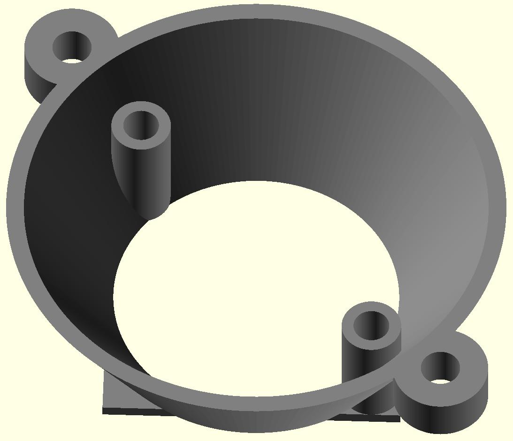

Fan Adapter for SiFive HiFive Unmatched
=======================================

The repository contains the OpenSCAD file and the STL file for a Fan adapter to
mount a 40 mm fan (e.g. Noctua NF-A4x10) on the CPU heat sink of the SiFive
HiFive Unmatched board.

You will need an M4 thread cutter for mounting the fan with M4x15mm screws.

This is an alternative design where the fan is radially offset with respect to
the heat sink.

.. image:: cpu_fan_adapter2.jpg
  :width: 400
  :alt: Fan adapter 2

License
-------

Creative Commons Attribution-ShareAlike 4.0 International Public License
(CC BY-SA 4.0)

Details see https://creativecommons.org/licenses/by-sa/4.0/
